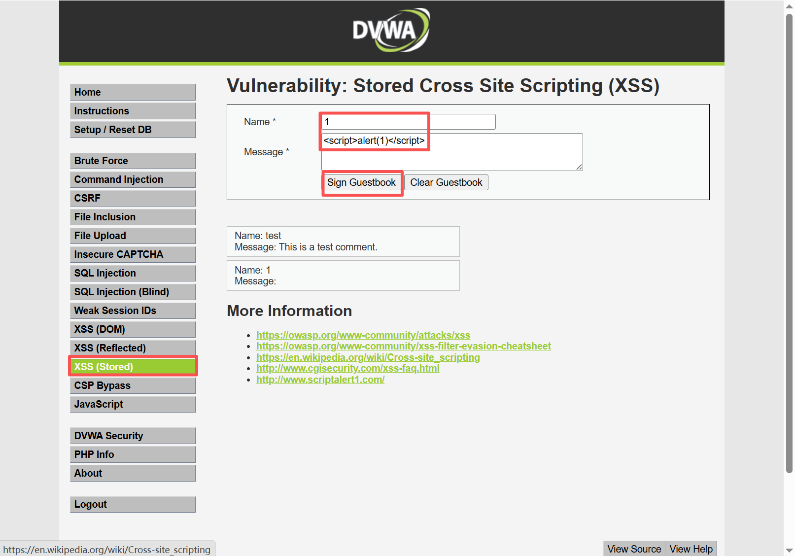
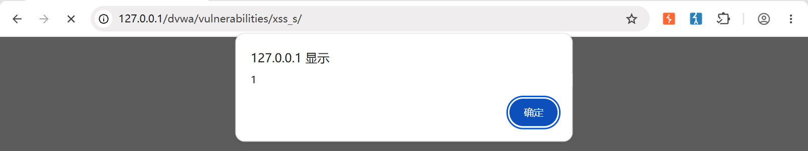
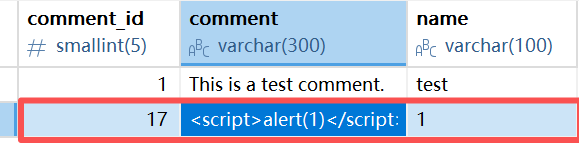
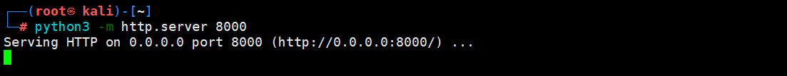
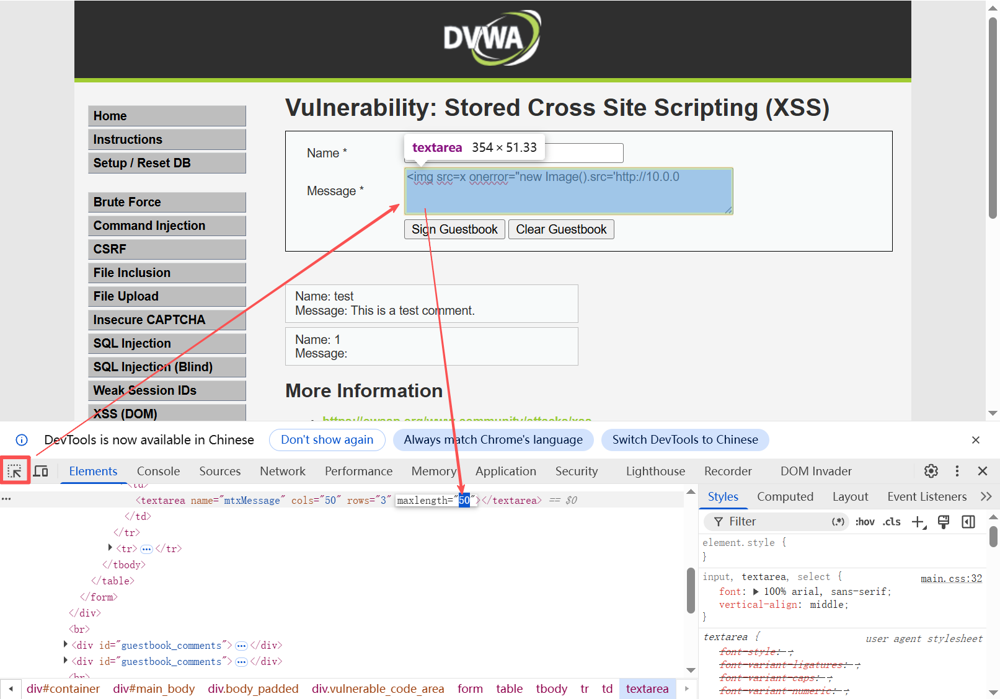
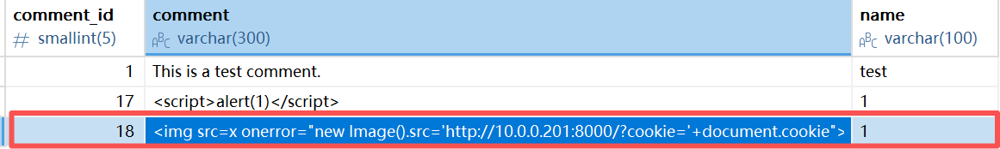
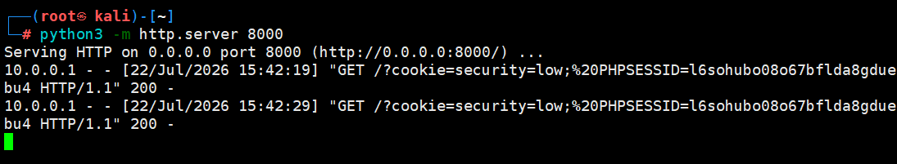
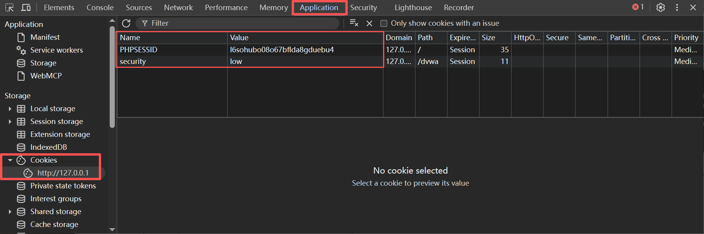

> Environment: PHP 7.3.4 + MySQL 5.7.26

> Lab: DVWA

---

## 1.0 Cookie劫持

### 1.1 基础部分

**01 什么是Cookie?**

用户在浏览器中输入账号密码登录网站后, 接下来的每次请求, 服务器如何知道 " 这个请求是刚才登录的那个用户发来的 " ?  `通过Cookie`

- **自动携带**: 浏览器每次向同一域名发送请求时, 会自动附带上该域名下的所有 Cookie
- **键值对结构**: `Cookie: name=value; name2=value2`
- **作用范围**: 由 `Domain` 和 `Path` 属性控制
- **有效期**: 由 `Expires` 或 `Max-Age` 决定, 若不设置则为“会话 Cookie”, 关闭浏览器即失效

**攻击者关心的三个安全属性**：

| 属性       | 作用                        | 攻击视角                                                     |
| ---------- | --------------------------- | ------------------------------------------------------------ |
| `HttpOnly` | 禁止 JavaScript 读取        | 开启后 `document.cookie` 读不到, 无法窃取 Cookie, 但仍可做钓鱼, CSRF |
| `Secure`   | 仅通过 HTTPS 传输           | 未设此属性时, HTTP 连接可被中间人窃听                        |
| `SameSite` | 控制跨站请求是否携带 Cookie | `Strict` 最严, `Lax` 允许 GET 跨站携带, `None` 全放行        |

**02 什么是Session?**

Session 是保存在**服务器端**的用户会话数据. 它的工作流程：

1. 用户登录成功 → 服务器创建一个 Session, 并生成唯一的 Session ID
2. 服务器把 Session ID 通过 `Set-Cookie` 头发给浏览器
3. 浏览器保存这个 Cookie, 后续每次请求自动带回
4. 服务器根据请求中的 Session ID, 查找对应的 Session 数据, 识别用户身份

**Session 与 Cookie 的关系**:

| 概念                    | 存储位置 | 相当于                                         |
| ----------------------- | -------- | ---------------------------------------------- |
| Session                 | 服务器端 | 保险柜, 存放用户的所有会话数据                 |
| Cookie(中的 Session ID) | 浏览器端 | 保险柜的钥匙，证明你就是你                     |
| Session 劫持            | 拿到钥匙 | 攻击者窃取 Cookie 后, 用钥匙打开受害者的保险柜 |

**攻击者视角核心认知**: Session 数据本身不会被窃取(它在服务器里), 但只要拿到 Cookie 里的 Session ID, 就能冒充受害者.

**03 Cookie劫持核心:**

如果攻击者通过 XSS 漏洞获取了受害者的 Cookie, 就等于拿到了受害者的 "临时身份证" 攻击者可以将这个 Cookie 写入自己的浏览器, 完全以受害者的身份登录网站, 无需知道用户名和密码.

---

### 1.2 Cookie窃取实战

**01 环境准备:**

- Windows-DVWA靶场
  - Level-Low
- Kali 攻击机
  - IP: 10.0.0.201

**02 攻击步骤梳理:**

- 确认XSS漏洞存在
- 编写Cookie窃取Payload
- 攻击机启动HTTP服务器
- Payload注入
- 模拟受害者访问
- Cookie会话劫持

以下实操附截图:
- **漏洞确认**

  

  > 如上图, 选择存储型XSS并构造Payload提交

  

  > 成功弹窗, 证明漏洞存在

  

  > 同时数据库成功写入一条记录

- **Payload构造**

  ```js
  
  ```

- **Kali启动HTTP服务**

  ```bash
  python3 -m http.server 8000
  ```

  

  > 进入监听...

- **Payload注入**

  - 如下图, 在注入内容时, 网站可能会做限制, 调用开发者工具修改对应属性

  

  > 修改 maxlength="500" 并提交

  

  > 数据库成功写入记录

- **受害者访问**

  - 新开页面登录靶场

- **Cookie劫持成功**

  

  > 如上图, 受害者访问后, 服务成功获取用户的cookie数据, 若要登录该账户, 只需做以下操作

  - 调用开发者工具 → Application → Storage(Cookies) → 替换PHPSESSID的Value

  

  > 成功执行后刷新页面

### 1.3 防御建议
1. 对输出进行 HTML 实体编码, 防止 XSS 注入
2. Cookie 设置 `HttpOnly` 属性, 禁止 JavaScript 读取
3. Cookie 设置 `Secure` 属性, 仅 HTTPS 传输
4. Cookie 设置 `SameSite=Lax` 或 `Strict`, 限制跨站携带
5. 对用户输入长度做后端校验, 不依赖前端限制

> 以上防御措施可从根本阻断 XSS 注入, Cookie 窃取及会话劫持攻击链